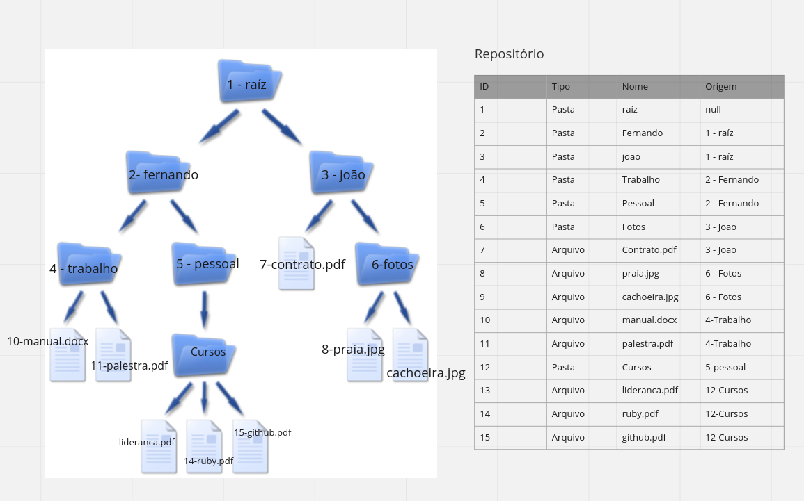

# Teste 1

Desenvolver a camada de modelos de um sistema de arquivos persistido em um banco de dados SQL onde seja possível criar diretórios e arquivos. Os diretórios poderão conter sub-diretórios e arquivos. O conteúdo dos arquivos podem estar ser persistidos como blob, S3 ou mesmo em disco.

A soluçãos deverá ser escrita majoritariamente em Ruby com framework Ruby on Rails.


## Desenho Inicial


## Instruções Iniciais
```
rails db:create
rails db:migrate
```
### Exemplos Criação de Pasta e Arquivo
```
rails c
```
#### Pasta
```
Folder.create(name: 'Fernando')
```
#### Arquivo
```
foto = File.open("/home/fernando/Downloads/foto1.jpeg")
```
```
params = { archive: { name: 'FotoNova.jpeg', storage_attributes: { document: foto } } } 
```
```
Archive.create!(params[:archive])
```

## Documentação
` http://localhost:3000/api-docs/index.html `
